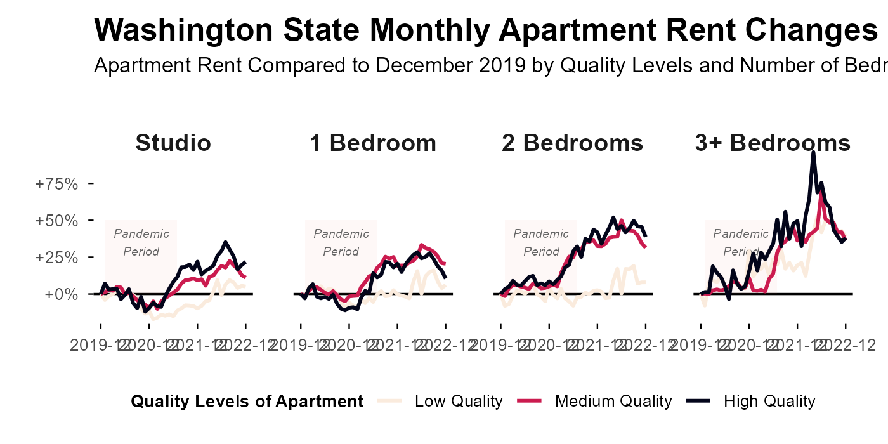

```{r setup, include=FALSE}
knitr::opts_chunk$set(echo = TRUE)
```

---

<!-- start of the main lab content --> 

In this lab, we are focusing on produce nice diagram using `ggplot2`. We will go through the production process of three plots. Please try to understand each step, including the rational, functions, and arguments. The dataset we are using is **residential real estate rental listing data**, from [RentHub](https://renthub.com) and can be accessed through [Dewey Data Platform](https://app.deweydata.io/data/renthub/rental-data-united-states-container/rental-data-united-states) (UW NetID required). 

The due day for each lab can be found on the [course wesbite](https://www.yuehaoyu.com/data-analytics-visualization/). The submission should include Rmd, html, and any other files required to rerun the codes. From Lab 4, the use of any generative AI tool (ChatGPT, Copilot, etc.) is **allowed**. But, I still encourage you to write codes by yourself and use AI tools as a way to debug and explore new knowledge. More information about [Academic Integrity](https://www.yuehaoyu.com/data-analytics-visualization/syllabus/#academic-integrity) and [the Use of AI](https://www.yuehaoyu.com/data-analytics-visualization/syllabus/#use-of-ai).

---

## Lab 04: Visualization using R and ggplot2

### GitHub Copilot (Optional)

Please allow me first introduce [GitHub Copilot for RStudio](https://docs.posit.co/ide/user/ide/guide/tools/copilot.html), an AI coding assistant. GitHub Copilot is available as an opt-in integration with RStudio. Because of the rapid development of AI, tools like Copilot, OpenAI's GPT, Claude are becoming common in data science workflows. It has dramatically lowered the barrier to entry for data analysis and visualization across industries. As a student, we can use it freely!

1. Open [GitHub Education](https://github.com/education)and click `Join GitHub Education`.
2. Log in your GitHub account. 
3. Under "GitHub Education", click `Start an application`.
4. Complete the form, then click `Submit application`.
5. Once your application is approved, you will receive an Email. 
6. Open `Edit - Settings` in RStudio, you can see `Copilot` on the left bar.
7. `Enable GitHub Copilot`, then `Sign in`.
8. Authorize RStudio to access your GitHub account.

You can also use other AI services, such as [Gemini from Google](https://gemini.google.com/), [ChatGPT from OpenAI](https://chatgpt.com/), or [Copilot from Microsoft](https://copilot.microsoft.com). Note: Microsoft Copilot with [commercial data protection](https://uwconnect.uw.edu/it?id=kb_article_view&sysparm_article=KB0034403) is enabled for UW faculty, staff, and students.

### Data Preparation 

RentHub provides us residential real estate rental listing data, including pricing, property information, location, and more from 2014 to present. The whole dataset is huge (over 100 GB). Therefore, we only select all data for the State of Washington during 2019-01-01 to 2024-12-31. Note: the time refers to when RentHub collected the data, rather than when the listing was originally posted. You can access the whole data through [Dewey Data Platform](https://app.deweydata.io/data/renthub/rental-data-united-states-container/rental-data-united-states) (UW NetID required). 

```{r}
# load necessary packages
library(tidyverse)
library(ggplot2)
library(skimr)
```

Because the dataset is large and cannot be stored in GitHub, please [download it through Dropbox](https://www.dropbox.com/scl/fi/oehagch9ivooesndaigq3/rental_data_wa.csv.zip?rlkey=h3b2krogfjj2mvzmjucg0sp2y&dl=0) and put the `rental_data_wa.csv` file within your lab 4 folder. 

```{r cache=TRUE}
# load the rental listing data, it may take a while because its size
rental <- read_csv("rental_data_wa.csv")
```

We filter the data to include listings posted between January 1, 2019, and December 31, 2023. There are 2,268,590 observations (rows) and 25 variables (columns) in total. The dataset is already tidy, so no further transformation is required. You can take a look at the meaning of each column.

```{r}
rental <- rental %>%
  filter(DATE_POSTED >= as.Date("2019-01-01") &
         DATE_POSTED <= as.Date("2023-12-31"))
# check the data dimension
dim(rental)
```

<details>
<summary>**Click to Read Data Dictionary**</summary>
- ID:	Unique identification number associated with each listing observation
- SCRAPED_TIMESTAMP: Data	collected time
- DATE_POSTED:	Date listing observation was posted on source
- CITY:	City in which listing observation is located
- NEIGHBORHOOD:	Neighborhood
- ZIP:	Property zip
- ADDRESS:	Address of building, unit, or home referred to in listing observation
- LATITUDE:	Property Latitude
- LONGITUDE:	Property Longitude
- COMPANY:	Property manager or owner name as listed on source
- BUILDING_TYPE:	Type of property referenced in listing observation
- BEDS:	Number of bedrooms in listing observation   
- BATHS:	Number of bathrooms in listing observation
- SQFT:	Approximate square footage in a listing observation
- RENT_PRICE:	Advertised rent price for a listing observation
- GRANITE:	The term "granite" is mentioned within the marketing description
- STAINLESS:	The term "stainless" is mentioned within the marketing description
- POOL: The term "pool" is mentioned within the marketing description
- GYM:	The term "gym" or "fitness center" or "health club" is mentioned within the marketing description
- DOORMAN:	The terms "doorman" or "attended lobby" is mentioned within the marketing description
- FURNISHED: The term "furnished" is mentioned within the marketing description
- LAUNDRY:	The terms "laundry" or "washer" or "washer/dryer" or "W/D" is mentioned within the marketing description
- GARAGE:	The term "garage" is mentioned within the marketing description
- GARAGE_COUNT:	Number of garage
- CLUBHOUSE:	The term "clubhouse" is mentioned within the marketing description
</details>

```{r cache=TRUE}
# skim the whole dataset
# skim(rental)
```

### Visualizing Time: An Example

Visualizing time is particularly valuable and interpretable in the context of rental markets, as it helps reveal market cycles, spatial heterogeneity, seasonal fluctuations, and structural shifts. We will use this section to produce a nice plot.

#### Thinking about the Message

Between 2019 and 2024, one of the most significant global events was the COVID-19 pandemic, which profoundly affected housing and rental markets. In this analysis, we are interested in **rent resiliency** across different groups after the pandemic — that is, how quickly and to what extent rents in various apartment types and quality levels recovered following the COVID-19 shock.

First, we filter the rental dataset to apartment buildings only and add four useful variables:

- `month`: the posting month of each listing, for time-series analysis
- `bed_group`: bedroom categories, for comparing rent trends by unit size
- `amenities_sum`: the total number of key amenities 
- `quality_group`: as the indicator of the quality level based on the values of `amenities_sum`

```{r}
rental_apt <- rental %>%
  filter(BUILDING_TYPE == "apartment building") %>%
  mutate(
    # converts posting date into the first day of its month for monthly analysis
    month = as.Date(paste0(format(as.Date(DATE_POSTED), "%Y-%m"), "-01")),
    # categorizes apartments by the number of bedrooms
    bed_group = case_when(
      BEDS == 0 ~ "Studio",
      BEDS == 1 ~ "1 Bedroom",
      BEDS == 2 ~ "2 Bedrooms",
      BEDS >= 3 ~ "3+ Bedrooms",
      TRUE ~ "Unknown"),
    # creates a variable counting how many of six amenities each listing offers
    amenities_sum = ( 
      (CLUBHOUSE == "Y") +
      (GRANITE == "Y") +
      (STAINLESS == "Y") +
      (POOL == "Y") +
      (GYM == "Y") +
      (DOORMAN == "Y")),
    # groups apartments into Low / Medium / High quality levels 
     quality_group = case_when(
      amenities_sum <= 1 ~ "Low Quality",
      amenities_sum %in% 2:4 ~ "Medium Quality",
      amenities_sum >= 5 ~ "High Quality",
      TRUE ~ "Unknown"
    ),
    # convert two variables from categorical to ordinal
    bed_group = factor(bed_group,
                       levels = c("Studio", "1 Bedroom", "2 Bedrooms", "3+ Bedrooms")),
    quality_group = factor(quality_group,
                           levels = c("Low Quality", "Medium Quality", "High Quality"))
  )
```

Then, let's calculate **average monthly rent** broken down by quality level and bedroom category. Notes: It is important to note that decisions about grouping, variable construction, and filtering should ideally be informed by exploratory data analysis and domain knowledge. For simplicity and clarity, these exploratory steps are not shown in this tutorial.

```{r}
apt_rent_by_month <- rental_apt %>%
  # group by three variables: month, quality_group, bed_group
  group_by(month, quality_group, bed_group) %>%
  dplyr::summarise(mean_rent = mean(RENT_PRICE, na.rm = TRUE), .groups = "keep") 
```

Let's produce the first plot about monthly rent trends for apartment buildings, separated by bedroom type and apartment quality. We have **four variables**: time, average rent, bedroom group, apartment quality. We need to determine the aesthetics (channels/encoding variables).

Recall the *Expressiveness + Effectiveness* we discussed: positions are always the best, so we put two important variables (time, average rent) as x and y. 

Apartment quality and bedroom group are ordinal categorical variables. We need to think about whether we want to preserve this order. If preserving order is not essential for our analytically purpose, we may treat them simply as nominal categories. In the current design, apartment quality (`quality_group`) is represented by color, while bedroom type (`bed_group`) is shown through faceting. 

```{r}
ggplot(apt_rent_by_month, aes(x = month, y = mean_rent, color = quality_group)) +
  geom_line() +
  facet_wrap(~bed_group)+
  labs(
    title = "Monthly Apartment Rent Trend 2019–2023",
    x = "Time",
    y = "Average Rent Price",
    color = "Quality Levels of Apartment"
  ) +
  theme_minimal() +
  theme(legend.position = "bottom")
```

In general, the figure looks quite good after some adjustments if our goal is simply to show overall rent trends. However, the key message I’d like to emphasize is the **rent resiliency** across different groups after the pandemic—that is, how quickly and strongly rents in various apartment types and quality levels recovered following the COVID-19 shock. The absolute rent levels are not particularly meaningful on their own, so we can make an adjustment by converting them into **relative rents**, measured as rent changes compared to December 2019 levels (pre-pandemic). 

```{r}
apt_rent_rel <- apt_rent_by_month %>%
  # compute relative change within each group
  group_by(quality_group, bed_group) %>%                
  mutate(
    # rent in Dec 2019 as baseline
    base_rent = mean_rent[month == as.Date("2019-12-01")], 
    # rent change (e.g., +10%)
    rent_change = (mean_rent - base_rent)/base_rent         
  ) %>%
  ungroup()
```

We are going to create a relatively complicated plot and you can have a look of the final result below. To achieve that, we need many functions in `ggplot2` and other software, such PowerPoint and PhotoShop, to do final edits (like the notes inside). 


#### Basic Stucture

Similar as previous plot. We started from the **data**: `apt_rent_rel`. We can do filter here to make sure the plot will only show the time period we want: between **December 2019** (just before the first Covid-19 case in Washington State) and **December 2022**. 

The we need to determine the **aesthetics** (channels/encoding variables), we map time to the x-axis, rent changes to the y-axis. There are two additional dimensions in the data: apartment quality (quality_group), which is represented by color, and bedroom type (bed_group), which is shown through **faceting**. 

After that, we are going to add the first **geometry**: `geom_line`. Its location is decided by the global `aes` we already defined. 

We also add the **labels**, including title, subtitle, x and y axis title, and the label for color group.

```{r}
g <- ggplot(
  filter(apt_rent_rel, month >= as.Date("2019-12-01") & month <= as.Date("2022-12-01")), 
  aes(x = month, y = rent_change, color = quality_group)
) +
  geom_line(linewidth = 1) +
  facet_wrap(~bed_group, nrow = 1) +
  labs(
    title = "Washington State Monthly Apartment Rent Changes Since Covid-19",
    subtitle = "Apartment Rent Compared to December 2019 by Quality Levels and Number of Bedroom. Data Source: RentHub, 2019-2022",
    x = "Time",
    y = "Relative Rent Change",
    color = "Quality Levels of Apartment"
  ) 
g
```

#### Graphical Primitives

We would like emphasize the line $y=0$ because it means no change compared to the beginning of the pandemic. Meanwhile, we need to let readers know the time period of the pandemic. So, we use `geom_hline()` to add a horizontal line as another layer. (Remember to check Cheatsheet, R documentation, and using `?function` when you are not familiar with a function.) 

There is another way we can simply draw a line is [adding an **annotation** layer](https://ggplot2.tidyverse.org/reference/annotate.html). But unlike a typical `geom` function, the properties of the `geoms` are not mapped from variables of a data frame, but are instead passed in as vectors. This is useful for adding small annotations (such as text labels or a line). We add a rectangular annotation to highlight a time period and text label with the rectangular. 

```{r}
g_line_rec <- g +   
  # add a horizontal line across the plot at y = 0
  geom_hline(yintercept = 0, linewidth = 0.6) +
  annotate("rect", # a rectangular
           # we need 4 points to determine the location
           xmin = as.Date("2020-01-01"), xmax = as.Date("2021-07-01"),
           ymin = 0, ymax = 0.5,
           fill = "#e37d5a", alpha = 0.05) + # explain below
  annotate("text", # some texts
           # we need 1 points to determine the location
           x = as.Date("2020-10-01"),
           y = 0.35,
           label = "Pandemic\nPeriod",
           color = "gray40", 
           size = 2.5, 
           fontface = "italic") # explain below
g_line_rec
```

##### Fontface

`fontface`/`face` is a catch-all argument that describes the style of the typeface to use. "plain" is an upright normal-weight font, "italic" is a slanted normal-weight font, "bold" is an upright bold-weight font, and "bold.italic" is a slanted bold-weight font.

##### Colors

We can use R built-in colors (600+), you can check their names using `colors()`. 

We can also use *Hex colors* and *palette functions*. Hex colors are written as `#RRGGBB`, where each pair (RR, GG, BB) represents the intensity of Red, Green, and Blue in hexadecimal (from 00 to FF, i.e., 0–255). ggplot2 provides built-in palette functions that automatically generate harmonious color sets for categorical or continuous variables.

R also supports numeric color systems like RGB, HCL, and HSV.

```{r}
# colors()
# scale_color_brewer(palette = "Set2")
# scale_color_viridis_d(option = "plasma")
```

#### Scale

Scale controls **how** data values are mapped to aesthetics (channels/encoding variables). For example, we use `color = quality_group` and by default `ggplot2` will choose some colors for that. But we can change how color encodes through `scale_color_*`. 

| **Aesthetic** | **Scale function** | **Controls** |
|----------------|--------------------|---------------|
| x-axis | `scale_x_*()` | axis range, tick marks, labels |
| y-axis | `scale_y_*()` | axis range, tick marks, labels |
| color | `scale_color_*()` | how color encodes categories or values |
| fill | `scale_fill_*()` | fill colors for bars, areas, etc. |
| size | `scale_size_*()` | point or line thickness |
| shape | `scale_shape_*()` | point shapes |
| alpha | `scale_alpha_*()` | transparency |

```{r}
g_scale <- g_line_rec +
  # change how assigns colors to the variable quality_group
  # use rocket palette style within viridis family
  # direction = -1 reverses the order of the palette
  scale_color_viridis_d(option = "rocket", direction = -1) +
  # where to place tick marks on the x-axis
  scale_x_date(
    breaks = as.Date(c("2019-12-01", "2020-12-01", "2021-12-01","2022-12-01")),
    labels = c("2019-12", "2020-12", "2021-12", "2022-12")
  ) +
  # formats the numeric values into percentages with a plus or minus sign
  scale_y_continuous(
    breaks = c(0, 0.25, 0.5, 0.75),
    labels = function(x) sprintf("%+d%%", x * 100)
  )
g_scale
```

#### Coordinate System

The coordinate system determines how data coordinates are translated to positions on the plot. We will talk about this more in the future class on mapping and geospatial data. 

```{r}
g_coordinate <- g_scale +
  # limits the y-axis to between −0.15 and 0.9
  coord_cartesian(ylim = c(-0.15, 0.9)) 
g_coordinate
```

#### Theme

Theme controls all non-data visual components, text, background, grid lines, margins, etc. 

##### Components

First, we need to know how `ggplot2` names those components:


You can see there is a hierarchy among those plot components. We list some here as the example, you can read [all components of a theme](https://ggplot2.tidyverse.org/reference/theme) from its official document.

- For the whole plot
  - `element_text()`: text, plot.title, plot.subtitle, plot.caption
  - `element_rect()`: plot.background, plot.margin
- For x and y axis
  - `element_text()`: axis.title.x/y, axis.text.x/y
  - `element_line()`: axis.line.x/y, axis.ticks.x/y
- For grid and panel
  - `element_line()`: panel.grid; panel.grid.major, panel.grid.minor
  - `element_rect()`: panel.border
  - `unit()`: panel.spacing
- For the legend
  - `element_text()`: legend.title, legend.text
  - `location using character/vector`: legend.position, legend.justification, legend.margin
- For facet
  - `element_text()`: strip.text, strip.text.x, strip.text.y
  - `element_rect()`: strip.background

##### Elements

There are several types of components, `ggplot2` calls them elements, such as text, line, and rectangular. For example, the line of axis is `element_line` while the title of axis is `element_text`. We remove some components through assigning them as `element_blank()`. 

We change the attributes of those components (such as legend.title, axis.line) by assigning them an appropriate `element_*()` function inside `theme()`. Please refer to its official document or `?element_*()` for detailed arguments - [Theme elements](https://ggplot2.tidyverse.org/reference/element.html).

##### Complete Themes

Beyond those specific theme configuration, we can start with existing complete themes by `+ theme_*()`. The one I like most is `theme_minimal()` because it is super clean. Within `theme_*()`, we can set a few argument for the whole plot: `base_family` for default font, `base_size` for default font size, for example.  

##### Theme Inheritance

It is useful to know **theme inheritance** feature of `ggplot2`: theme elements inherit properties from other theme elements hierarchically. For example, there is the hierarchy for text elements:

text
 ├── plot.title
 ├── plot.subtitle
 ├── axis.title
      ├── axis.title.x / axis.title.y
 └── legend.text / legend.title

##### Modify our Plot using Theme

```{r}
# (Optional) help Windows map the font name
windowsFonts(Arial = windowsFont("Arial"))

g_theme <- g_coordinate +
  theme_minimal(base_family = "Arial", base_size = 12) +
  theme(
    # ---------- whole plot ----------
    text = element_text(lineheight = 1.1, family = "Arial"),
    plot.title = element_text(face = "bold", size = 18, family = "Arial"),
    plot.margin = margin(10, 20, 10, 20),

    # ---------- axes ----------
    axis.title.x = element_blank(),
    axis.title.y = element_blank(),
    axis.ticks.x = element_line(linewidth = 0.4),
    axis.ticks.y = element_line(linewidth = 0.4),

    # ---------- panel ----------
    panel.grid = element_blank(),
    panel.spacing.x = unit(1.6, "lines"),

    # ---------- legend ----------
    legend.position = "bottom",
    legend.title = element_text(size = 10, face = "bold", family = "Arial"),

    # ---------- facet ----------
    strip.background = element_blank(),
    strip.text.x = element_text(face = "bold", size = 14,
                                margin = margin(t = 25), family = "Arial")


  )
g_theme
```

#### The Complete PLot

```{r}
ggplot(
  filter(apt_rent_rel, month >= as.Date("2019-12-01") & month <= as.Date("2022-12-01")), 
  aes(x = month, y = rent_change, color = quality_group)
) +
  # 1️⃣ geometry 
  geom_hline(yintercept = 0, linewidth = 0.6) +
  annotate("rect",
           xmin = as.Date("2020-01-01"), xmax = as.Date("2021-07-01"),
           ymin = 0, ymax = 0.5,
           fill = "#e37d5a", alpha = 0.05) +
  annotate("text",
           x = as.Date("2020-10-01"),
           y = 0.35,
           label = "Pandemic\nPeriod",
           color = "gray40", size = 2.5, fontface = "italic") +
  geom_line(linewidth = 1) +

  # 2️⃣ scale
  scale_color_viridis_d(option = "rocket", direction = -1) +
  scale_x_date(
    breaks = as.Date(c("2019-12-01", "2020-12-01", "2021-12-01","2022-12-01")),
    labels = c("2019-12", "2020-12", "2021-12", "2022-12")
  ) +
  scale_y_continuous(
    labels = function(x) sprintf("%+d%%", x * 100),
    breaks = c(-0.25, 0, 0.25, 0.5, 0.75, 1.0)
  ) +

  # 3️⃣ facet and coordinate system
  facet_wrap(~bed_group, nrow = 1) +
  coord_cartesian(clip = "off", ylim = c(-0.15, 0.9)) +

  # 4️⃣ labels
  labs(
    title = "Washington State Monthly Apartment Rent Changes Since Covid-19",
    subtitle = "Apartment Rent Compared to December 2019 by Quality Levels and Number of Bedroom. Data Source: RentHub, 2019-2022",
    x = "Time",
    y = "Relative Rent Change",
    color = "Quality Levels of Apartment"
  ) +

  # 5️⃣ theme
  theme_minimal(base_family = "Helvetica", base_size = 12) +
  theme(
    text = element_text(lineheight = 1.1),
    plot.title = element_text(face = "bold", size = 18),
    axis.title.x = element_blank(),
    axis.ticks.x = element_line(linewidth = 0.4),
    axis.ticks.y = element_line(linewidth = 0.4),
    axis.title.y = element_blank(),
    legend.position = "bottom",
    legend.title = element_text(size = 10, face = "bold"),
    panel.grid = element_blank(),
    strip.background = element_blank(),
    strip.text.x = element_text(face = "bold", size = 14, margin = margin(t = 25)),
    panel.spacing.x = unit(1.6, "lines"),
    plot.margin = margin(10, 20, 10, 20)
  )

# save it as 14 inch * 7 inch
ggsave("rent_change_plot.png", width = 14, height = 7, dpi = 200)
# save it as 7 inch * 3.5 inch
ggsave("rent_change_plot_735.png", width = 7, height = 3.5, dpi = 200)
```

When working with ggplot2, customizing the `theme()` controls visual style — but the final output size and aspect ratio are just as important. RStudio preview **IS NOT** the actual exported figure. I will recommend that you work within a single chunk and check changes in exported figure all the time. I decided to use 14 * 7 inch at the beginning so it is perfect when I export as 14 * 7 inch. But the following figure was exported as 7 * 3.5 inch: everything squeezed together. 



#### Final Edits

Not every figure — or every visual component within a figure — is best created entirely in R.

While `ggplot2` is powerful for data-driven visualization, it’s not always flexible for fine-grained graphic design tasks. For example, in this plot, it is cumbersome to  adding a single line and text because we used facets. We can always combine R/`ggplot2` with other tools, like PowerPoint and Photoshop. Here, we added an explanation on pandemic and a directional line using Photoshop.


### 📚 TODO: Critique of Data Visualizations

**Chosen example:** [Minard’s “Napoleon’s March to Moscow” (1869)](https://en.wikipedia.org/wiki/Charles_Joseph_Minard)

**What it communicates:** Size of Napoleon’s army over space and time, connecting troop losses to geography, direction, temperature, and dates.

**Why it works (class principles):**
- **Encodings:** Position (map path, temperature timeline), width/area (army size), color hue (advance vs retreat), text labels (cities, counts).
- **Hierarchy & unity:** One dominant ribbon (army) with a coordinated temperature panel; alignment by date supports cross-reading.
- **Narrative design:** Optimized for *story*, not precise lookup—great for retention and comprehension after legend is understood.

**Limitations:** Exact value comparisons on curved widths are imprecise; schematic map can introduce small spatial ambiguity; color distinction requires a clear legend.

**Static vs interactive:** Static.  
**Purpose (appeal, comprehension, retention):** High appeal & retention; comprehension strong once legend is clear.  
**Basic elements present:** Title, legend, encodings, aligned axes; minimal but sufficient scaffolding.


### 📚 TODO: Creative Visualization

**Theme / Message:** Larger apartments have higher total rent, but **price-per-square-foot decreases** as size increases (diminishing marginal price).

We’ll provide two simple idioms with clear code: a **boxplot** and a **scatter with smoothing**.

### A) 2023 Rent by Bedroom (Boxplot)

```{r}
# Ensure apartment subset exists; create if not found
if (!exists("rental_apt")) {
  rental_apt <- rental %>%
    dplyr::filter(BUILDING_TYPE == "apartment building") %>%
    dplyr::mutate(
      month = as.Date(paste0(format(as.Date(DATE_POSTED), "%Y-%m"), "-01")),
      bed_group = dplyr::case_when(
        BEDS == 0 ~ "Studio",
        BEDS == 1 ~ "1 Bedroom",
        BEDS == 2 ~ "2 Bedrooms",
        BEDS >= 3 ~ "3+ Bedrooms",
        TRUE ~ "Unknown"
      ),
      bed_group = factor(bed_group, levels = c("Studio","1 Bedroom","2 Bedrooms","3+ Bedrooms"))
    )
}

rent_2023 <- rental_apt %>% dplyr::filter(format(month, "%Y") == "2023")

ggplot(rent_2023, aes(bed_group, RENT_PRICE, fill = bed_group)) +
  geom_boxplot(outlier.alpha = 0.15) +
  scale_y_continuous(labels = scales::dollar_format()) +
  labs(title = "2023 Advertised Rent by Bedroom Group (WA)",
       x = "Bedroom Group", y = "Advertised Rent ($)",
       caption = "Source: RentHub (WA, 2023)") +
  theme_minimal() +
  theme(legend.position = "none")
```

**Why this design:** Boxplots compactly show medians/spread/outliers for categorical comparisons using **position/length** encodings.

### B) Rent vs. Square Footage by Bedroom (Scatter + Smooth)

```{r}
# 1) Precompute quantiles once (not inside filter)
q_sqft <- quantile(rental_apt$SQFT,       0.99, na.rm = TRUE)
q_rent <- quantile(rental_apt$RENT_PRICE, 0.99, na.rm = TRUE)

rent_sqft <- rental_apt %>%
  dplyr::filter(!is.na(SQFT),
                SQFT > 100, SQFT < q_sqft,
                RENT_PRICE > 300, RENT_PRICE < q_rent)

# 2) (Optional) Downsample per facet to speed up both plotting and smoothing
rent_sqft_small <- rent_sqft %>%
  dplyr::group_by(bed_group) %>%
  dplyr::slice_sample(n = 20000, replace = FALSE) %>%  # adjust n if needed
  dplyr::ungroup()

# 3) Replace LOESS with a fast GAM smoother (great for big n)
ggplot(rent_sqft_small, aes(SQFT, RENT_PRICE)) +
  geom_point(alpha = 0.12, size = 0.3) +
  geom_smooth(
    method  = "gam",
    formula = y ~ s(x, k = 6),   # small k = faster, still smooth
    se      = TRUE
  ) +
  facet_wrap(~ bed_group, nrow = 1) +
  scale_y_continuous(labels = scales::dollar_format()) +
  labs(title = "Rent vs. Square Footage by Bedroom (WA, 2019–2023)",
       x = "Square Feet", y = "Advertised Rent ($)",
       caption = "Source: RentHub (WA, 2019–2023)") +
  theme_minimal()

```

**What to notice:** Rents rise with size (positive slope), but the curve flattens at larger SQFT, implying lower **price-per-sqft**. Different bedroom groups show distinct ranges and slopes.


### 📚 TODO: Deceptive Visualization

**Goal:** Demonstrate subtle, realistic ways plots can mislead **without** fabricating data.

### A) Deceptive Boxplot via Truncated Axis

```{r}
ggplot(rent_2023, aes(bed_group, RENT_PRICE, fill = bed_group)) +
  geom_boxplot(outlier.alpha = 0.15) +
  coord_cartesian(ylim = c(1500, 2500)) +  # 🔴 Truncation exaggerates differences
  labs(title = "2023 Rent by Bedroom (Deceptive Axis)",
       subtitle = "Truncating the y-axis narrows range and inflates visual gaps",
       x = "Bedroom Group", y = "Advertised Rent ($)",
       caption = "Deception: Y-axis truncation") +
  theme_minimal() +
  theme(legend.position = "none")
```

### B) Deceptive Bar Chart via Category Reordering

```{r}
amen_summ <- rental_apt %>%
  dplyr::filter(format(month, "%Y") == "2023") %>%
  dplyr::mutate(
    CLUBHOUSE = if_else(is.na(CLUBHOUSE), "N", CLUBHOUSE),
    GRANITE   = if_else(is.na(GRANITE),   "N", GRANITE),
    STAINLESS = if_else(is.na(STAINLESS), "N", STAINLESS),
    POOL      = if_else(is.na(POOL),      "N", POOL),
    GYM       = if_else(is.na(GYM),       "N", GYM),
    DOORMAN   = if_else(is.na(DOORMAN),   "N", DOORMAN),
    amenities_sum = (CLUBHOUSE == "Y") + (GRANITE == "Y") + (STAINLESS == "Y") +
                    (POOL == "Y") + (GYM == "Y") + (DOORMAN == "Y")
  ) %>%
  dplyr::group_by(bed_group) %>%
  dplyr::summarise(avg_amenities = mean(amenities_sum, na.rm = TRUE), .groups = "drop") %>%
  dplyr::mutate(bed_group = factor(bed_group, levels = c("3+ Bedrooms","2 Bedrooms","1 Bedroom","Studio"))) # 🔴 implies a trend

ggplot(amen_summ, aes(bed_group, avg_amenities)) +
  geom_col(width = 0.6) +
  labs(title = "Average Amenities by Bedroom (Deceptive Order)",
       subtitle = "Ordering categories to imply a monotonic decline",
       x = "Bedroom Group (Reordered)", y = "Avg. Amenities",
       caption = "Deception: Category order biases perceived trend") +
  theme_minimal()
```

**Reflection:** Truncating the y-axis compresses visible range and **overstates** differences between medians. Reordering categories **implies** a pattern that may not exist. Both are plausible in real reports and highlight why small, “reasonable” changes can meaningfully bias interpretation.


### 📚 TODO: Tableau Installization (optional)

**0 point**

Next week, we are going to use Tableau, which provides free access to students. Please try to download [Tableau for Students](https://www.tableau.com/academic/students) in advance. 

## Acknowledgement

The materials are developed by [Haoyu Yue](www.yuehaoyu.com) based materials from [Dr. Feiyang Sun at UC San Diego](https://fsun.ucsd.edu), Siman Ning and Christian Phillips at University of Washington, [Dr. Charles Lanfear at University of Cambridge](https://clanfear.github.io).
